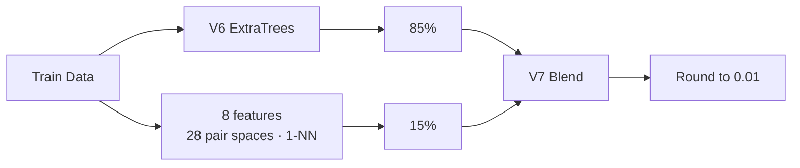

<div align="center">

# 🧠 Stress Score Prediction — V7 Research

### Pair-Neighbor Quantile Blend

<p>
  
  
  
</p>

**Scope:** V1~V8 계보 · V7 Pair-Neighbor 재현 코드 · Train-only 검증

</div>

## V7 결과

| 항목 | 결과 |
|---|---:|
| 대표 모델 | **V7 Pair-Neighbor Quantile Blend** |
| Train-only Audit3 MAE | **0.146644** |
| Public MAE | **0.1272333333** |
| 제출 시점 | 2026-08-01 14:43 KST |
| 당시 Public leaderboard | 1위 |

**구성:** V6 Adaptive Feature-Probability ExtraTrees `85%` + Pair-Neighbor `15%`  
**선정 기준:** Train-only validation  
**출력:** 0.01 반올림

## 모델 구조



### Pair-Neighbor

- 핵심 피처 8개
- 모든 2차원 조합 → 28개 pair space
- Train 기준 경험적 rank
- Manhattan 1-NN
- 이웃 target 분위수 집계
- 전역 ExtraTrees의 국소 보완

## V8 후속 실험

| 모델 | Audit 평균 MAE | Public MAE |
|---|---:|---:|
| V7 | `0.150134` | **`0.1272333333`** |
| V8 | `0.150044` | `0.1274733333` |

**Audit:** 신규 seed 3/3 V8 우세  
**Public:** V8 `+0.00024` 악화  
**판정:** 미승격

- [`validation/V8_MODEL_REPORT.md`](validation/V8_MODEL_REPORT.md)
- [`model_history/v8/final_submission_v8.py`](model_history/v8/final_submission_v8.py)

## 실행

```text
/data/
  train.csv
  test.csv
  sample_submission.csv
```

```bash
pip install -r requirements.txt
python final_submission.py --data-dir /data --output-dir .
```

**Output:** `submit_v7_pair_neighbor_blend.csv`  
**Versioned copy:** [`model_history/v7/final_submission_v7.py`](model_history/v7/final_submission_v7.py)

## 검증 자료

- [`model_history/README.md`](model_history/README.md) — V1~V8 계보
- [`validation/V7_MODEL_REPORT.md`](validation/V7_MODEL_REPORT.md) — V7 검증
- [`validation/V7_DATA_QUALITY_REPORT.md`](validation/V7_DATA_QUALITY_REPORT.md) — 데이터 품질
- [`validation/V7_TRAIN_ONLY_ANALYSIS.ipynb`](validation/V7_TRAIN_ONLY_ANALYSIS.ipynb) — Train-only 분석
- [`validation/VALIDATION_PROTOCOL.md`](validation/VALIDATION_PROTOCOL.md) — 검증 계약

**Validation boundary:** 전처리 · 결측 대체 · rank 기준 · 인코딩은 Train-only. 외부 데이터 미사용.

## Related Repositories

| Repository | 범위 |
|---|---|
| [`stress_project_UNIFIED`](https://github.com/thisisstress/stress_project_UNIFIED) | 팀 최종 결과 · 전체 계보 |
| [`stress_project_BS`](https://github.com/thisisstress/stress_project_BS) | 최종 BS 8/6 모델 |
| `stress_project_SK` | 대안 모델 · 후속 R&D |

**Team final:** BS 8/6  
**V7 status:** Historical team-lineage milestone

**Data boundary:** 원본 `train.csv` · `test.csv` · 정답 레이블 미포함.

## License and attribution

**Public view · no public reuse license.**  
팀 제작 코드·문서·원본 도식은 All Rights Reserved. 별도 서면 허가 없는 재사용·수정·재배포 불가.

공동 저자와 역할: [AUTHORS.md](AUTHORS.md) · 권리 범위와 제3자 자료: [LICENSE](LICENSE) · [LICENSE_SCOPE.md](LICENSE_SCOPE.md)
