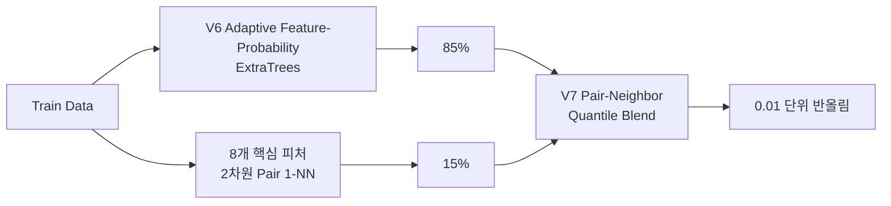

<div align="center">

# 🧠 Stress Score Prediction

### 신체 정보와 생활 패턴을 활용한 스트레스 점수 회귀 프로젝트

<p>
  
  
  
  
</p>

</div>

---

## 🏆 현재 최고 결과

- 평가 지표: MAE (낮을수록 좋음)
- 최종 채택 모델: **V7 Pair-Neighbor Quantile Blend**
- Train-only 신규 Audit3 MAE: **0.146644**
- Public MAE: **0.1272333333**
- 리더보드: **2026-08-01 14:43 KST 제출 당시 1위**

V7은 V6 Adaptive Feature-Probability ExtraTrees 예측 85%와 8개 핵심
피처의 모든 2차원 조합에서 구한 Train 1-NN 분위수 예측 15%를 혼합합니다.
혼합 비율과 모든 하이퍼파라미터는 Test가 아닌 Train-only 검증으로 고정했고,
최종 예측은 타깃 격자에 맞춰 0.01 단위로 반올림합니다.

### 모델 구조 한눈에 보기



---

## 🧪 V8 제출 결과

V8 Robust Subspace-Neighbor Blend는 가중치 고정 뒤 신규 Audit Seed 3개에서
V7을 3/3으로 이겼습니다(Audit 평균 0.150044, V7 0.150134). 그러나 Public
MAE는 **0.1274733333**으로 V7의 0.1272333333보다 **0.0002400000 악화**됐습니다.
따라서 V8은 미채택 실험으로 보존하고, 현재 최고 기록과 루트 기본 실행 코드는
V7으로 유지합니다.

- [V8 상세 검증 보고서](validation/V8_MODEL_REPORT.md)
- [V8 최종 실행 코드](model_history/v8/final_submission_v8.py)

---

## 📚 모델 및 검증 기록

- [V1~V8 전체 모델 이력](model_history/README.md)
- [V7 상세 검증 보고서](validation/V7_MODEL_REPORT.md)
- [V7 데이터 품질 보고서](validation/V7_DATA_QUALITY_REPORT.md)
- [실행 완료 분석 노트북](validation/V7_TRAIN_ONLY_ANALYSIS.ipynb)
- [검증 프로토콜](validation/VALIDATION_PROTOCOL.md)

각 버전은 `model_history/v1`부터 `model_history/v7`까지 같은 순서로 정리되어
있습니다. V5는 승격 기준을 통과하지 못해 최종 제출 코드를 만들지 않았으며,
폐기 이유와 실험 코드를 기록으로 남겼습니다.

---

## 🚀 실행 방법

데이터 파일을 `/data`에 배치합니다.

```text
/data/
  train.csv
  test.csv
  sample_submission.csv
```

환경을 설치하고 현재 최고 모델의 학습·추론 코드를 실행합니다.

```bash
pip install -r requirements.txt
python final_submission.py --data-dir /data --output-dir .
```

실행이 끝나면 `submit_v7_pair_neighbor_blend.csv`가 생성됩니다. 제출용 단일
파일 원본은 `model_history/v7/final_submission_v7.py`에도 동일하게 보존합니다.

---

## 🛡️ 누수 방지 원칙

- Test 데이터로 인코더·결측 대체값·스케일러를 학습하지 않습니다.
- 전처리기와 경험적 순위 기준은 Train 데이터에서만 학습합니다.
- 파생변수는 한 행 안의 입력값만 사용합니다.
- Test 전체 통계, 행 수, 인덱스 또는 순서를 모델링에 사용하지 않습니다.
- 외부 데이터를 사용하지 않습니다.

---

## 🔒 저장소 보안

대회 데이터, 제출 CSV와 학습 모델 파일은 대회 규정 및 보안을 위해 Git에서 제외합니다.
