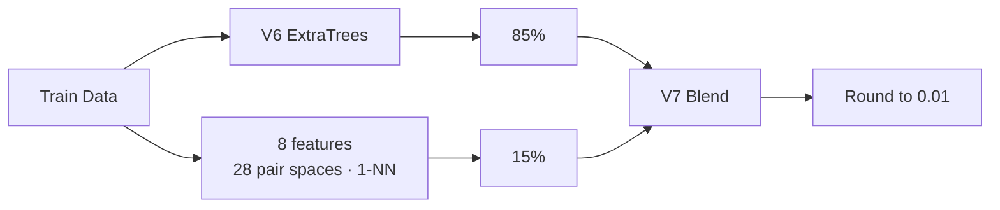

<div align="center">

# 🧠 Stress Score Prediction — V7 Research

### Pair-Neighbor Quantile Blend

<p>
  
  
  
</p>

이 저장소는 V1~V8 모델 이력과 V7 Pair-Neighbor 모델의 재현 코드·검증 기록을 보존합니다.

</div>

## V7 결과

| 항목 | 결과 |
|---|---:|
| 대표 모델 | **V7 Pair-Neighbor Quantile Blend** |
| Train-only Audit3 MAE | **0.146644** |
| Public MAE | **0.1272333333** |
| 제출 시점 | 2026-08-01 14:43 KST |
| 당시 Public leaderboard | 1위 |

V7은 V6 Adaptive Feature-Probability ExtraTrees 예측 85%와 Pair-Neighbor 예측 15%를 결합합니다. 혼합 비율과 하이퍼파라미터는 Train-only 검증으로 정했고, 최종 예측은 0.01 단위로 반올림합니다.

## 모델 구조



Pair-Neighbor는 8개 핵심 피처의 모든 2차원 조합에서 가장 가까운 Train 샘플을 찾고, 여러 이웃 타깃을 분위수 방식으로 결합해 전역 트리 모델이 놓치는 국소 패턴을 보완합니다.

## V8 후속 실험

V8 Robust Subspace-Neighbor Blend는 가중치를 고정한 뒤 신규 Audit seed 3개에서 V7을 3/3으로 이겼습니다.

| 모델 | Audit 평균 MAE | Public MAE |
|---|---:|---:|
| V7 | `0.150134` | **`0.1272333333`** |
| V8 | `0.150044` | `0.1274733333` |

내부 Audit에서는 개선됐지만 Public MAE가 `0.00024` 악화되어 V8은 대표 모델로 승격하지 않았습니다.

- [`validation/V8_MODEL_REPORT.md`](validation/V8_MODEL_REPORT.md)
- [`model_history/v8/final_submission_v8.py`](model_history/v8/final_submission_v8.py)

## 실행

데이터 파일을 한 디렉터리에 준비합니다.

```text
/data/
  train.csv
  test.csv
  sample_submission.csv
```

```bash
pip install -r requirements.txt
python final_submission.py --data-dir /data --output-dir .
```

실행 후 `submit_v7_pair_neighbor_blend.csv`가 생성됩니다. 동일한 제출 코드는 [`model_history/v7/final_submission_v7.py`](model_history/v7/final_submission_v7.py)에도 보존되어 있습니다.

## 검증 자료

- [`model_history/README.md`](model_history/README.md) — V1~V8 모델 이력
- [`validation/V7_MODEL_REPORT.md`](validation/V7_MODEL_REPORT.md) — V7 검증 결과
- [`validation/V7_DATA_QUALITY_REPORT.md`](validation/V7_DATA_QUALITY_REPORT.md) — 데이터 품질 확인
- [`validation/V7_TRAIN_ONLY_ANALYSIS.ipynb`](validation/V7_TRAIN_ONLY_ANALYSIS.ipynb) — Train-only 분석
- [`validation/VALIDATION_PROTOCOL.md`](validation/VALIDATION_PROTOCOL.md) — 검증 방식

전처리, 결측 대체, rank 기준과 인코딩은 Train에서 학습하며 외부 데이터는 사용하지 않습니다.

## Related Repositories

| Repository | 내용 |
|---|---|
| [`stress_project_UNIFIED`](https://github.com/thisisstress/stress_project_UNIFIED) | 팀 최종 결과와 전체 모델 계보 |
| [`stress_project_BS`](https://github.com/thisisstress/stress_project_BS) | V7 이후 발전한 최종 BS 8/6 모델 |
| `stress_project_SK` | 대안 모델과 후속 R&D 기록 |

팀 최종 채택 모델은 V7이 아니라 BS 8/6입니다. 최종 결과는 `stress_project_UNIFIED`에서 확인할 수 있습니다.

대회 원본 `train.csv`·`test.csv`와 정답 레이블은 저장소에 포함하지 않습니다.

## License and attribution

**Public view · no public reuse license.**  
팀 제작 코드·문서·원본 도식은 All Rights Reserved. 별도 서면 허가 없는 재사용·수정·재배포 불가.

공동 저자와 역할: [AUTHORS.md](AUTHORS.md) · 권리 범위와 제3자 자료: [LICENSE](LICENSE) · [LICENSE_SCOPE.md](LICENSE_SCOPE.md)
